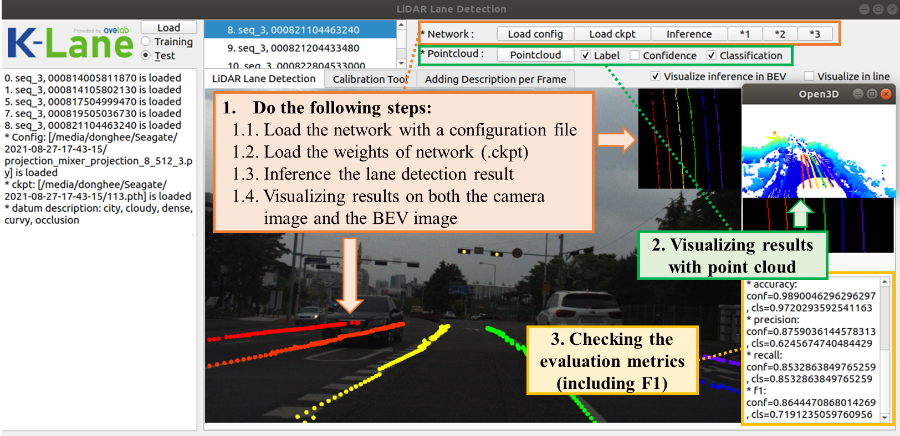
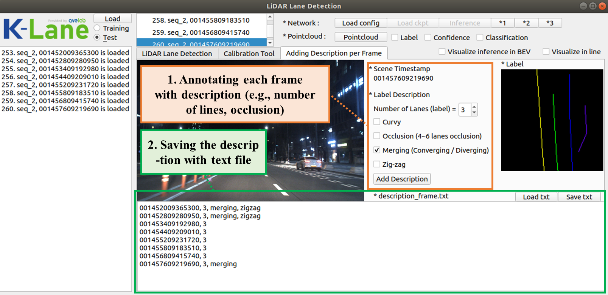
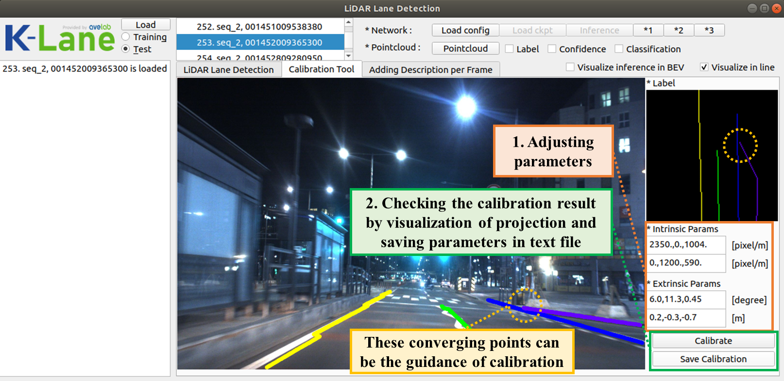

# K-Lane Visualization Tool

This is the documentation on how to use the visualization provided in K-Lane

# Requirements

1. Install the dependencies for visualization tool
```
pip install -r requirements.txt
```
2. Make sure to change the path of the `data_root` in `/configs/config_vis.py` to the `K-Lane` root directory
 

# Workspace Arrangement
1. Download the dataset from our Google Drive <a href="" title="K-Lane Dataset">K-Lane Dataset</a>
2. Workspace directory structure:
```
KLaneDet
├── annot_tool
├── baseline 
├── configs
├── data
      ├── KLane
            ├── test
            ├── train
                  ├── seq_1
                  :
                  ├── seq_15 
├── logs
```
# Visualization Tool
1. Starts the visualization tool
```
python visualize.py
```
2. The initial GUI will show the default options,


# Visualizing Inference
The lane detection inference results can be visualized on the camera image, BEV image, or LiDAR point cloud by using our visualization tool.
1. To visualize the detection results on camera image, BEV image, and LiDAR point cloud (shown on separate window using `Open3D`), do the following steps:



2. Additional descriptions of each scene shown in the visualization tool can be made via the description tab,



# Calibrating LiDAR to Camera
Projection of the lane detections from LiDAR point clouds to the camera image can be done by calibrating the internal and external parameters. These parameters can be iteratively found by using our calibration tool,



