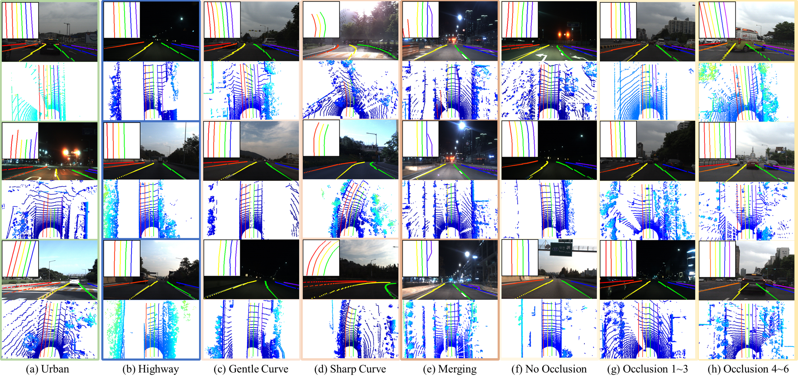

`K-Lane` is the world's first open LiDAR lane detection frameworks that provides a dataset with wide range of driving scenarios in an urban environment. This repository provides the `K-Lane` frameworks, annotation tool for lane labelling, and the visualization tool for showing the inference results and calibrating the sensors.





# K-Lane Detection Frameworks
This is the documentation for how to use our detection frameworks with K-Lane dataset.
We tested the K-Lane detection frameworks on the following environment:
* Python 3.7 / 3.8
* Ubuntu 18.04
* Torch 1.7.1
* CUDA 11.2

# Preparing the Data
1. To download the dataset, log in to <a href="https://kaistavelab.direct.quickconnect.to:54568/"> our server </a> with the following credentials: 
      ID       : klaneds
      Password : Klane2022
2. Go to the "File Station" folder, and download the dataset by right-click --> download.
   Note for Ubuntu user, there might be some error when unzipping the files. Please check the "readme_to_unzip_file_in_linux_system.txt".
3. After all files are downloaded, please arrange the workspace directory with the following structure:
```
KLaneDet
├── annot_tool
├── baseline 
├── configs
├── data
      ├── KLane
            ├── test
            ├── train
                  ├── seq_1
                  :
                  ├── seq_5 
├── logs
```


# Requirements
1. Clone the repository
```
git clone ...
```

2. Install the dependencies
```
pip install -r requirements.txt
```

# Training Testing
* To test from a pretrained model download the pretrained model from our Google Drive <a href="https://en.wikipedia.org/wiki/Hobbit#Lifestyle" title="K-Lane Dataset">Model</a> and run
```
python validate.py ...
```
* Testing can be done either with the python script or the GUI visualization tool. To test with the GUI visualization tool, please refer to the <a href = "https://github.com/..." title="Visualization Tool"> visualization tool page </a>

## Development Kit 
1. [Visualization Tool](./docs/visualization.md)
      * [Requirements](./docs/visualization.md#Requirements)
      * [Workspace Arrangement](./docs/visualization.md#Workspace-Arrangement)
      * [Visualizing Inference](./docs/visualization.md#Visualizing-Inference)
      * [Calibrating LiDAR to Camera](./docs/visualization.md#Calibrating-LiDAR-to-Camera)
2. [Annotation Tool](./docs/annotation.md)
      * [Requirements](./docs/annotation.md#Requirements)
      * [Workspace Arrangement](./docs/annotation.md#Workspace-Arrangement)
      * [Labelling a Point Cloud](./docs/annotation.md#Labelling-a-Point-Cloud)

## Updates
* [2022-04-18] v1.0.0 is released along with the K-Lane Dataset. Please check [Getting Started](./docs/KLane.md#Workspace-Arrangement) for the download instruction.

## License
`K-Lane` is released under the MIT License

## Acknowledgement
The dataset is made by `Donghee Paek`, `Kevin Tirta Wijaya`, `Dongin Kim`, and `Minhyeok Sun`, supervised by `Seunghyun Kong`

We thank the maintainers of the following projects that enable us to develop `K-Lane`:
* [`OpenPCDet`](https://github.com/open-mmlab/OpenPCDet) by MMLAB

## Citation

If you find this work is useful for your research, please consider citing:
```
@InProceedings{paek2022klane,
  title     = {K-Lane: Lidar Lane Dataset and Benchmark for Urban Roads and Highways},
  author    = {Paek, Dong-Hee and Kong, Seung-Hyun and Wijaya, Kevin Tirta},
  booktitle = {Proceedings of the IEEE/CVF Conference on Computer Vision and Pattern Recognition (CVPR) Workshops},
  month     = {June},
  year      = {2022}
}
```
